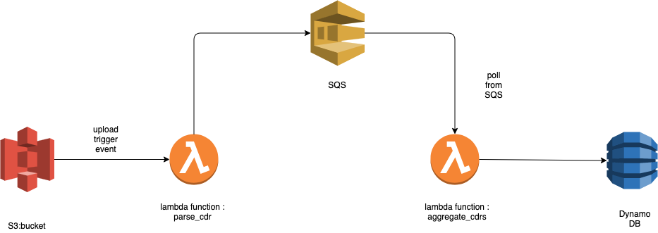

Serverless POC
==============

this is a POC `Not A Real Business Scenario` to demonstrate the capabilities of serverless architecture using serverless framework and AWS cloud
provider

#### Diagram

### POC Scenario

- User upload a cdr (Call Details Record) file to S3 bucket.
- `S3` trigger an asynchronous event when a new Object is created in the bucket, this even start to execute `parse_cdr`
  lambda function.
- `parse_cdr` lambda function do the following:
    - load the file from the `S3` bucket. 
    - read the file line by line.
    - extracts a specific fields from the line.
    - send the extracted fields as a message to `SQS`.
  
- `aggregate_cdrs` lambda function do the following:
    - poll the new message from the `SQS`.
    - convert the value of `data_in` and `data_out`
    - save the record in a `DynamoDB` table.
  
  
  
  

